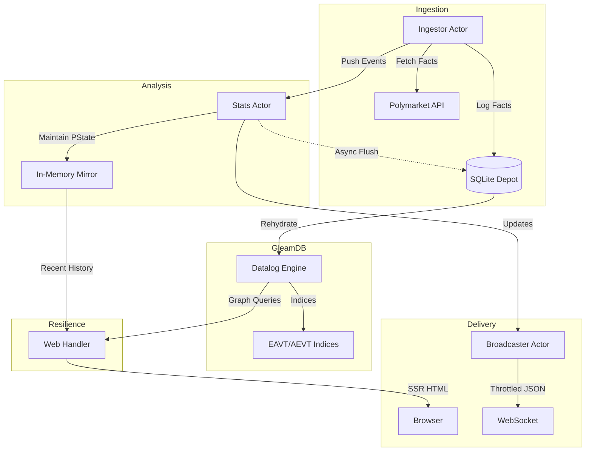

# Amkabot 🧙🏾‍♂️

**Amkabot** is a high-fidelity analytics engine for prediction markets, built with Gleam and the actor model. It distinguishes itself by moving beyond simple PnL tracking to measure the underlying **predictive skill** and **trader networks** of market participants.

## 🔮 The Predictive Suite

Amkabot implements several advanced metrics to evaluate trader performance:

- **Calibration Score**: Measures how well a trader's predicted probabilities align with realized outcomes.
- **Sharpness Score**: Quantifies the degree of certainty in a trader's successful predictions.
- **Related Traders (Graph)**: Leverages **GleamDB** to identify clusters of traders based on shared market entry and betting patterns.
- **Brier Score**: A strictly proper scoring rule that measures the accuracy of probabilistic predictions.

## 🏗️ Architecture: Local-First & Graph-Integrated

Amkabot follows a "Rama Pattern" (Depot -> PState -> Query), prioritized for robustness and performance:



### 🛡️ Database-Resilient Analytics
The system is designed to be **Local-First**. Historical snapshots and recent activity logs are mirrored in the Stats Actor's memory. **GleamDB** provides a specialized **Silicon Saturation** layer on top of **SQLite**, using ETS-backed indices for O(1) concurrent reads. This allows Amkabot to perform multi-entity graph queries and skill evaluations without blocking ingestion.

## 🚀 Getting Started

### Prerequisites
- [Gleam](https://gleam.run/) 1.14+
- [Erlang/OTP](https://www.erlang.org/) 26+
- [SQLite](https://sqlite.org/) (Built-in persistence via `sqlight`)

### Run the Engine
```sh
gleam run
```

### Run the Test Suite
```sh
# Achieves 100% logic coverage for the analytical core and graph queries
gleam test
```

---
*Amkabot: High-Fidelity Analytics for the Prediction Economy.*
