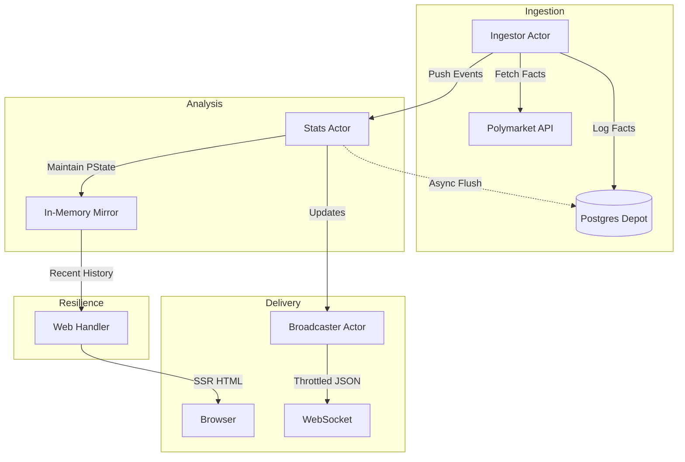

# Amkabot 🧙🏾‍♂️

**Amkabot** is a high-fidelity analytics engine for prediction markets, built with Gleam and the actor model. It distinguishes itself by moving beyond simple PnL tracking to measure the underlying **predictive skill** of market participants.

## 🔮 The Predictive Suite

Amkabot implements several advanced metrics to evaluate trader performance:

- **Calibration Score**: Measures how well a trader's predicted probabilities align with realized outcomes. A score of 1.0 indicates perfect probabilistic alignment.
- **Sharpness Score**: Quantifies the degree of certainty (variance from the mean) in a trader's successful predictions.
- **Momentum-Weighted ROI**: Performance metrics that weight recent activity more heavily using a systematic time-decay algorithm (30-day half-life).
- **Brier Score**: A strictly proper scoring rule that measures the accuracy of probabilistic predictions.

## 🏗️ Architecture: Local-First & Decomplectant

Amkabot follows a "Rama Pattern" (Depot -> PState -> Query), prioritized for robustness and performance:



### 🛡️ Database-Resilient Analytics
The system is designed to be **Local-First**. Historical snapshots and recent activity logs are mirrored in the Stats Actor's memory. If the persistent database is unavailable, Amkabot continues to serve high-fidelity analytics, sparklines, and activity feeds without interruption.

## 🚀 Getting Started

### Prerequisites
- [Gleam](https://gleam.run/) 1.14+
- [Erlang/OTP](https://www.erlang.org/) 26+
- [PostgreSQL](https://www.postgresql.org/) (Optional, system falls back to in-memory)

### Run the Engine
```sh
gleam run
```

### Run the Test Suite
```sh
# Achieves 100% logic coverage for the analytical core
gleam test
```

---
*Amkabot: High-Fidelity Analytics for the Prediction Economy.*
